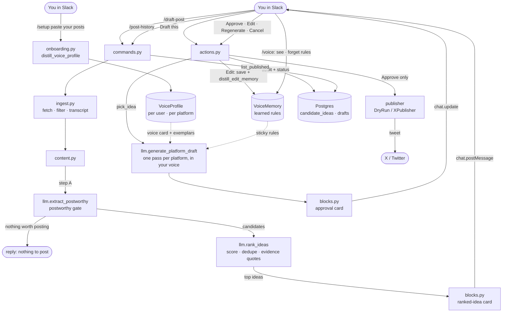

# Ghostwyre

A Slack-native AI agent. Teach it your voice once with `/setup` (paste a few of
your real posts), then run `/draft-post` in a channel: Ghostwyre scans the recent
conversation, **ranks the ideas actually worth posting** — each scored, with the
real quotes that sparked it — and shows you a shortlist to **pick** from. Pick one
and it drafts a long **LinkedIn** post and a long **X** post **in your voice** —
each generated in its own pass against that platform's voice and strategy, grounded
in what was actually said. **Edit** any draft before approving and Ghostwyre learns
your tweaks — distilling durable style rules that steer every future draft (see them
anytime with `/voice`). You can publish the X draft with one **Approve** click
(LinkedIn is copy-paste). The human-in-the-loop approval gate is mandatory; nothing
is ever auto-posted.

It's a small, deliberately-narrow portfolio project that takes one workflow
end-to-end with production-minded plumbing: async everywhere, a multi-step LLM
pipeline (extract → rank → draft) that **learns from your edits**, persisted approval
state, and an at-most-once publish gate.

## Demo


_Record: `/draft-post` → pick a draft → **Approve** → the live link posts back →
`/post-history` lists what you've published._

## How it works



- **Ingest** (`app/slack/ingest.py`) pulls recent messages (up to `IDEA_SCAN_LIMIT`),
  drops noise (bots, joins, the bot's own posts), resolves names, and builds a
  chronological transcript. The transcript is treated as confidential — never logged.
- **Voice** (`app/slack/onboarding.py` → `llm.distill_voice_profile`) — `/setup`
  opens a modal where you paste a few of your real X and LinkedIn posts plus what
  you want to be known for; Ghostwyre distills a per-platform **voice card** +
  positioning and stores them as a `VoiceProfile` per `(user, platform)`. Users
  without a profile fall back to the static `voice.md` seed, so the flow works
  before onboarding.
- **Find the idea** (`app/services/content.py` → `llm.{extract_postworthy,rank_ideas}`)
  — a cheap *postworthy gate* can short-circuit with "nothing to post"; otherwise
  `rank_ideas` scores every candidate (novelty, specificity, audience value, "would
  you proudly share this"), **merges near-duplicates**, and attaches the real
  transcript quotes that sparked each. The top `IDEA_SHORTLIST_SIZE` are posted as a
  **ranked-idea card** — making "we filtered the channel down to *these*" visible —
  and you click **Draft this** on the one you want. (A channel with one clear idea
  skips the picker and drafts it immediately.)
- **Generate** (`llm.generate_platform_draft`) — for the chosen idea, drafts **one
  long post per platform** in a separate LLM pass each, fed only that platform's
  voice card, positioning, strategy, and a few of your real posts as exemplars
  (lightweight relevance), grounded in the actual transcript. Structured JSON output
  + prompt caching on the system prompt and voice card. Works on Claude or Groq.
- **Approve / Edit** (`app/slack/{blocks,actions}.py`) persists the batch first, posts
  one living Block Kit card (each draft labelled by platform), and resolves every
  button by id. Approve appears only for the **X** draft within `X_CHAR_LIMIT`;
  LinkedIn (and over-limit X) is copy-paste. **Edit** opens a modal to tweak a draft;
  Regenerate re-drafts the same chosen idea; Cancel dismisses — each idempotent.
- **Learn** (`app/slack/editing.py` → `llm.distill_edit_memory`) — when you Edit a
  draft, Ghostwyre diffs your version against its own and distills durable style rules
  ("don't open with 'I'", "no emojis") into a per-`(user, platform)` `VoiceMemory`.
  Those rules ride along (as an extra cached system block) on every future draft, so
  it gets better the more you use it. `/voice` lists what's been learned, with a
  **Forget** button to prune a bad rule. Only edits are mined — never approve/regen.
- **Publish** (`app/services/publisher.py`, `x_publisher.py`) is a `PublisherClient`
  Protocol: `DryRunPublisher` by default, `XPublisher` (tweepy) when `PUBLISHER=x`.

## Who can use it / access

Ghostwyre is a **self-hosted Slack app for a single workspace** — there's no hosted
SaaS or "Add to Slack" button. To use it you run your own instance: clone the repo,
create your own Slack app, and point it at an LLM key + a Postgres database (the
**Quick start** below). It runs in **Socket Mode**, so it connects *out* to Slack —
**no public server or URL is needed** (a laptop, a small VPS, Fly.io/Railway, even a
Raspberry Pi works); the only requirement is keeping the process running.

- **Free to try:** use Groq's free tier (`LLM_PROVIDER=groq`) + the default dry-run
  publisher (`PUBLISHER=dry`, posts a fake link) + Dockerized Postgres — **$0**, no X
  account needed. Real tweets need the paid X Basic tier.
- **Let others try it:** invite them into the workspace where your instance runs —
  voice and learned memory are per Slack user, so each person gets their own `/setup`,
  drafts, and `/voice`, all served by your one process.
- **Not built (it's a portfolio/self-host tool):** always-on managed hosting, a
  multi-workspace OAuth "install" flow, and data retention/encryption — see
  [Status & limitations](#status--limitations).

## Quick start (dev)
```bash
make install        # uv sync
make db-up db-wait  # Postgres via Docker
make migrate        # alembic upgrade head
cp .env.example .env  # then fill in your tokens
make tweet          # smoke test: dry-run publish
make dev            # run the app (Slack Socket Mode)
make test           # fast tests   ·   make test-all = incl. Postgres
make lint           # ruff + mypy
```
Requires Python 3.12, Docker, and [uv](https://docs.astral.sh/uv/).

**Slack setup:** create an app, enable Socket Mode, and enable **Interactivity**
(the `/setup` and Edit modals need it). Add scopes `commands`, `channels:history`,
`chat:write`, and `im:write` (so Ghostwyre can DM you the `/setup` confirmation).
Register four slash commands — `/setup`, `/draft-post`, `/post-history`, and
`/voice`. Invite the bot to a channel, then run the commands there.

## Teaching your voice (`/setup`)

Run `/setup` and paste a handful of your real posts (one blank line between each)
for X and/or LinkedIn, plus a line on what you want to be known for. Ghostwyre
distills a per-platform voice card and stores it; from then on `/draft-post` (and
**Regenerate**) write in *your* voice, differently on each platform. You can re-run
`/setup` any time to refresh it. Until you do, drafts use the generic `voice.md`
seed — onboarding is optional but makes the drafts sound like you. Your pasted
posts are user content at rest and are never logged.

## Learning from your edits (Edit + `/voice`)

Every draft card has an **Edit** button: tweak the post, hit Save, and that becomes
the text Approve publishes. Ghostwyre also compares your edit to its own draft and
distills the *durable* style rules behind your change ("don't open with 'I'", "no
emojis", "shorter paragraphs") into your voice memory — so it doesn't make the same
mistake next time. The rules ride along on every future draft (and Regenerate); the
edit itself only fixes the current post. Run **`/voice`** to see what's been learned
per platform and hit **Forget** to drop a rule that's drifting. Only your edits are
learned from — not approvals or regenerates — so the signal stays intentional.
`VOICE_MEMORY_LIMIT` caps how many rules feed each draft. (Very long drafts can't be
edited in Slack's modal — copy-paste those instead.)

## Publishing to X

By default `PUBLISHER=dry` uses a no-network dry-run publisher (it returns a fake
link), so the whole flow works end-to-end without an X account. To publish for
real:

1. Provision the X **Basic** tier (paid) with **write** access and generate
   OAuth 1.0a user-context credentials (API key/secret + access token/secret).
2. Install the optional extra: `uv sync --extra x` (or `pip install ghostwyre[x]`).
3. In `.env`, set `PUBLISHER=x` and fill `X_API_KEY`, `X_API_SECRET`,
   `X_ACCESS_TOKEN`, `X_ACCESS_TOKEN_SECRET`.
4. `make tweet` posts a real hardcoded tweet (the publish-path smoke test); then
   `/draft-post` → **Approve** publishes the selected draft and drops the live
   link back in the channel.

**Approve is the only publish path** — nothing is ever auto-posted, and the
approval click publishes at most once. Reverting to dry-run is a one-setting
change (`PUBLISHER=dry`).

**Long X posts & `X_CHAR_LIMIT`:** drafts are long-form by design. The X draft is
publishable via Approve only when it fits `X_CHAR_LIMIT` (default 25000). Posting
more than 280 characters to X needs **X Premium**; without it, keep the X draft
short or just copy-paste. LinkedIn has no API integration here — its draft is
always copy-paste. If you raise `X_CHAR_LIMIT`, also raise `DRAFT_MAX_TOKENS`.

## Design decisions

- **Publishing is an interface, not a hard dependency.** Callers code against a
  `PublisherClient` Protocol; swapping dry-run ↔ real X is one setting, and tweepy
  stays an optional extra off the default path.
- **A postworthy filter before drafting.** The first LLM step can say "nothing
  here is worth posting" and skip drafting entirely — the difference between a real
  tool and a slop generator.
- **Transparent idea-finding, with evidence.** It doesn't silently pick for you:
  it scores and ranks the candidate ideas and shows the *real quotes* behind each,
  so "we filtered the channel down to these" is inspectable, not a black box.
- **Learns from your edits, not tone sliders.** Voice comes from your real posts
  (`/setup`) and from how you edit drafts — distilled into durable rules you can see
  and prune (`/voice`). The signal is intentional (edits only), and it's additive:
  rules layer onto the voice card rather than rewriting it.
- **At-most-once publish gate.** Approve atomically claims the batch (a
  compare-and-swap `pending → approved`) and commits *before* the network call, so
  a double-click, Slack retry, or failed card update can never double-post.
  Ambiguous failures (rate limit / network) are surfaced for a human to verify
  rather than blindly retried.
- **Async everywhere**, structured logging with PII redaction (raw message and
  draft text are never logged), and secrets only via `pydantic-settings`.

## Status & limitations

All of v1 (Phases 0–5) and v2 (**Pillars A–D**: voice-from-posts, platform-native
generation, idea ranking + pick, feedback memory) is shipped. Known follow-ups not
yet built: **data retention** — transcripts and post history are kept in Postgres
indefinitely with no cleanup/expiry — and encryption-at-rest. Voice memory persists
until you `/voice` → Forget it.

## Stack
Python 3.12 · FastAPI · Slack Bolt (Socket Mode) · LLM provider-agnostic — Anthropic
SDK (Claude) or Groq, chosen by `LLM_PROVIDER` · SQLAlchemy (async) + Alembic +
PostgreSQL · tweepy (X, optional extra).

Build plans: `dev-docs/chat-to-content-agent-v1-plan.md` (v1) and
`dev-docs/chat-to-content-agent-v2-plan.md` (v2, Pillars A–D).

## License

Licensed under the **Apache License 2.0** — see [LICENSE](LICENSE) and [NOTICE](NOTICE).
You may use, modify, and distribute it (incl. commercially) with attribution; it
includes an explicit patent grant and comes with no warranty.
