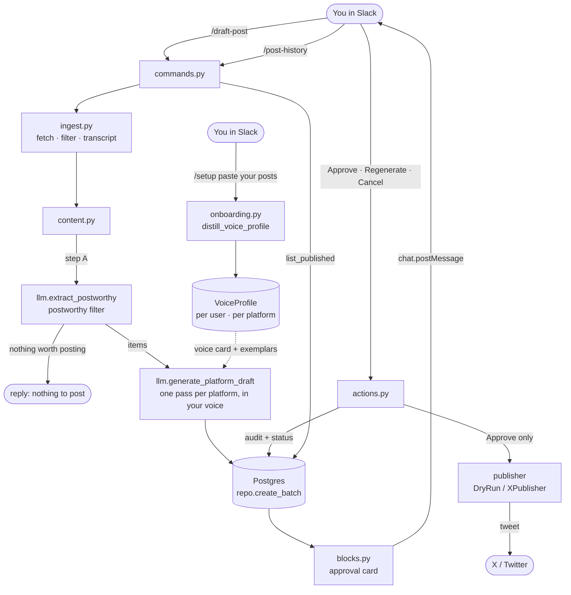

# Ghostwyre

A Slack-native AI agent. Teach it your voice once with `/setup` (paste a few of
your real posts), then run `/draft-post` in a channel: Ghostwyre reads the recent
conversation, decides whether anything is actually worth posting, and drafts a
long **LinkedIn** post and a long **X** post **in your voice** — each generated in
its own pass against that platform's voice and strategy, and grounded in what was
actually said. You can publish the X draft to X with one **Approve** click
(LinkedIn is copy-paste). The human-in-the-loop approval gate is mandatory;
nothing is ever auto-posted.

It's a small, deliberately-narrow portfolio project that takes one workflow
end-to-end with production-minded plumbing: async everywhere, a two-step LLM
pipeline, persisted approval state, and an at-most-once publish gate.

## Demo


_Record: `/draft-post` → pick a draft → **Approve** → the live link posts back →
`/post-history` lists what you've published._

## How it works



- **Ingest** (`app/slack/ingest.py`) pulls recent messages, drops noise (bots,
  joins, the bot's own posts), resolves names, and builds a chronological
  transcript. The transcript is treated as confidential — never logged.
- **Voice** (`app/slack/onboarding.py` → `llm.distill_voice_profile`) — `/setup`
  opens a modal where you paste a few of your real X and LinkedIn posts plus what
  you want to be known for; Ghostwyre distills a per-platform **voice card** +
  positioning and stores them as a `VoiceProfile` per `(user, platform)`. Users
  without a profile fall back to the static `voice.md` seed, so the flow works
  before onboarding.
- **Generate** (`app/services/content.py` → `llm.py`) runs a *postworthy filter*
  that can short-circuit with "nothing to post", then drafts **one long post per
  platform** — a separate LLM pass each, fed only that platform's voice card,
  positioning, strategy, and a few of your real posts as exemplars (picked by
  lightweight relevance), grounded in the actual transcript (not a lossy summary).
  Structured JSON output + prompt caching on the system prompt and voice card.
  Works on Claude or Groq.
- **Approve** (`app/slack/{blocks,actions}.py`) persists the batch first, posts one
  living Block Kit card (each draft labelled by platform), and resolves every
  button by id. Approve appears only for the **X** draft within `X_CHAR_LIMIT`;
  LinkedIn (and over-limit X) is copy-paste. Regenerate re-runs generation, Cancel
  dismisses — each idempotent.
- **Publish** (`app/services/publisher.py`, `x_publisher.py`) is a `PublisherClient`
  Protocol: `DryRunPublisher` by default, `XPublisher` (tweepy) when `PUBLISHER=x`.

## Quick start (dev)
```bash
make install        # uv sync
make db-up db-wait  # Postgres via Docker
make migrate        # alembic upgrade head
cp .env.example .env  # then fill in your tokens
make tweet          # smoke test: dry-run publish
make dev            # run the app (Slack Socket Mode)
make test           # fast tests   ·   make test-all = incl. Postgres
make lint           # ruff + mypy
```
Requires Python 3.12, Docker, and [uv](https://docs.astral.sh/uv/).

**Slack setup:** create an app, enable Socket Mode, and enable **Interactivity**
(the `/setup` voice modal needs it). Add scopes `commands`, `channels:history`,
`chat:write`, and `im:write` (so Ghostwyre can DM you the `/setup` confirmation).
Register three slash commands — `/setup`, `/draft-post`, and `/post-history`.
Invite the bot to a channel, then run the commands there.

## Teaching your voice (`/setup`)

Run `/setup` and paste a handful of your real posts (one blank line between each)
for X and/or LinkedIn, plus a line on what you want to be known for. Ghostwyre
distills a per-platform voice card and stores it; from then on `/draft-post` (and
**Regenerate**) write in *your* voice, differently on each platform. You can re-run
`/setup` any time to refresh it. Until you do, drafts use the generic `voice.md`
seed — onboarding is optional but makes the drafts sound like you. Your pasted
posts are user content at rest and are never logged.

## Publishing to X

By default `PUBLISHER=dry` uses a no-network dry-run publisher (it returns a fake
link), so the whole flow works end-to-end without an X account. To publish for
real:

1. Provision the X **Basic** tier (paid) with **write** access and generate
   OAuth 1.0a user-context credentials (API key/secret + access token/secret).
2. Install the optional extra: `uv sync --extra x` (or `pip install ghostwyre[x]`).
3. In `.env`, set `PUBLISHER=x` and fill `X_API_KEY`, `X_API_SECRET`,
   `X_ACCESS_TOKEN`, `X_ACCESS_TOKEN_SECRET`.
4. `make tweet` posts a real hardcoded tweet (the publish-path smoke test); then
   `/draft-post` → **Approve** publishes the selected draft and drops the live
   link back in the channel.

**Approve is the only publish path** — nothing is ever auto-posted, and the
approval click publishes at most once. Reverting to dry-run is a one-setting
change (`PUBLISHER=dry`).

**Long X posts & `X_CHAR_LIMIT`:** drafts are long-form by design. The X draft is
publishable via Approve only when it fits `X_CHAR_LIMIT` (default 25000). Posting
more than 280 characters to X needs **X Premium**; without it, keep the X draft
short or just copy-paste. LinkedIn has no API integration here — its draft is
always copy-paste. If you raise `X_CHAR_LIMIT`, also raise `DRAFT_MAX_TOKENS`.

## Design decisions

- **Publishing is an interface, not a hard dependency.** Callers code against a
  `PublisherClient` Protocol; swapping dry-run ↔ real X is one setting, and tweepy
  stays an optional extra off the default path.
- **A postworthy filter before drafting.** The first LLM step can say "nothing
  here is worth posting" and skip drafting entirely — the difference between a real
  tool and a slop generator.
- **At-most-once publish gate.** Approve atomically claims the batch (a
  compare-and-swap `pending → approved`) and commits *before* the network call, so
  a double-click, Slack retry, or failed card update can never double-post.
  Ambiguous failures (rate limit / network) are surfaced for a human to verify
  rather than blindly retried.
- **Async everywhere**, structured logging with PII redaction (raw message and
  draft text are never logged), and secrets only via `pydantic-settings`.

## Stack
Python 3.12 · FastAPI · Slack Bolt (Socket Mode) · Anthropic SDK (Claude) ·
SQLAlchemy (async) + Alembic + PostgreSQL · tweepy (X, optional).

The full build plan lives in `dev-docs/chat-to-content-agent-v1-plan.md`.
